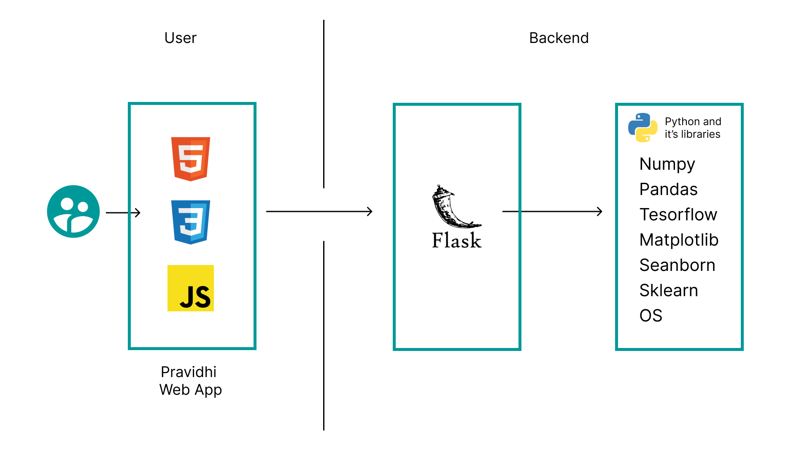
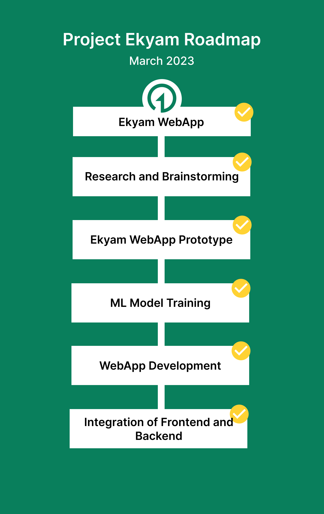

 

# Nidan/Ekyam

- [Project summary](#project-summary)
  - [The issue we are hoping to solve](#the-issue-we-are-hoping-to-solve)
  - [How our technology solution can help](#how-our-technology-solution-can-help)
  - [Our idea](#our-idea)
- [Technology implementation](#technology-implementation)
  - [Solution architecture](#solution-architecture)
- [Presentation materials](#presentation-materials)
  - [Solution demo video](#solution-demo-video)
  - [Project development roadmap](#project-development-roadmap)
- [Additional details](#additional-details)
  - [How to run the project](#how-to-run-the-project)
  - [Live demo](#live-demo)
- [About this template](#about-this-template)
  - [Contributing](#contributing)
  - [Versioning](#versioning)
  - [Authors](#authors)
  - [License](#license)
  - [Acknowledgments](#acknowledgments)

## Project summary

### The issue we are hoping to solve

REPLACE THIS SENTENCE with a short description, 2-3 sentences in length, of the specific sustainability problem your solution is meant to address.

### How our technology solution can help

REPLACE THIS SENTENCE with a short description of your team's solution, in about 10 words.

### Our idea

INSTRUCTIONS: Replace this paragraph with a longer description of your solution. In about 500 words, describe your solution in more detail. Include the real-world problem you identified, describe the technological solution you have created, and explain how it’s an improvement over existing solutions. You can supply additional documentation in this source code repository that you link to as well.

More detail is available in our [description document](./docs/DESCRIPTION.md).

## Technology implementation

### Solution architecture

Diagram and step-by-step description of the flow of our solution:

1. The user navigates to the site and uploads a video file.
2. Watson Speech to Text processes the audio and extracts the text.
3. Watson Translation (optionally) can translate the text to the desired language.
4. The app stores the translated text as a document within Object Storage.

## Presentation materials

### Solution demo video

### Project development roadmap

The project currently does the following things.

- Case Study of Worlds cleanest Country
- Generating money through Waste Management
- Segregating waste to recyclable and Organic
- Segregating waste to different type
- Predicting the crop to grown in order to reduce the waste generated through farmlands

In the future we plan to...
- Bottle Segregation to different materials (trained through Yolo)
- Storing users data to database to show them a dasboard of their trackrecord
- Promoting awareness by providing them with more options to generate money
- Doing clustering of neighbourhoods to provide them with more waste management tips according to their clusters
See below for our proposed schedule on next steps after Call for Code 2023 submission.

## Additional details

### How to run the project

INSTRUCTIONS: In this section you add the instructions to run your project on your local machine for development and testing purposes. You can also add instructions on how to deploy the project in production.

### Live demo

You can find a running system to test at...

See our [description document](./docs/DESCRIPTION.md) for log in credentials.

---

